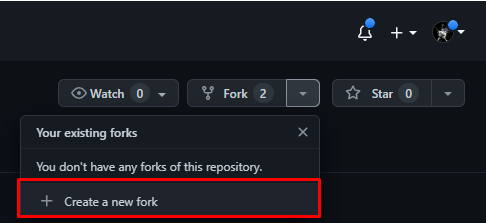
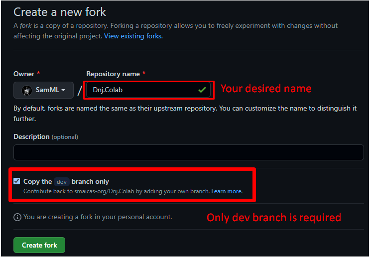
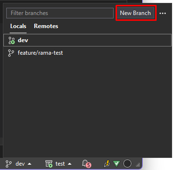
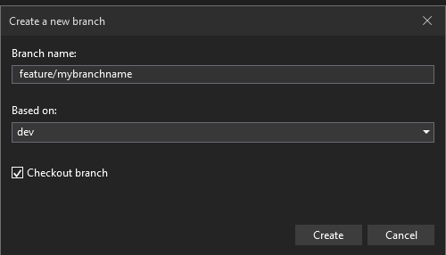
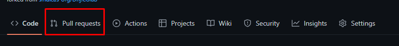
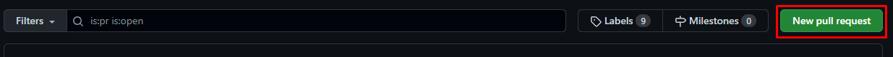
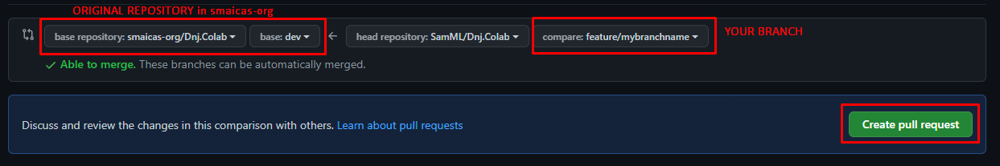

Introduction
============

This repository aims to be a meeting point for programmers of all levels. 
The idea is not only to learn to program but also to learn code integration, to know and adopt a professional way of working. 
Appropriate to the way you work in a company. It is an open source repository and anyone is invited to contribute.

* * *

Content
=======

* * *

How to collaborate?
===================


How to collaborate?
===================
### Download repository
1 - Create a GitHub account

2 - Go to [repository page](https://github.com/smaicas-org/Dnj.Colab) and "Create a new Fork"


It will create a copy of the original repository in your account.
Navigate to the recently created repository and press the "Code" button.
Copy the url to the repository.

3 - Clone the repository manually or using an IDE such Visual Studio:
- Manually:	
REPOSITORY URL must have the format  https://USERNAME@github.com/source/path.git to specify the username.
```
git clone {REPOSITORY URL}
```
- Using Visual Studio:


4 - Implement your changes in the project allocated in dev branch of your forked repository. 

5 - Once your change are ready to merge with the original project.
Create a new branch with base in 'dev'. 
(You can do it manually or you can use software as Fork, SourceTree or your desired IDE)
- Manually:
```
git checkout dev
```
```
git switch -c "feature/mybranchname"
```
- Using Visual Studio:



6 - Commit changes to you recently created branch and push it to remote repository.
- Manually:
```
git add .
```
```
git commit -m "COMMIT MESSAGE WITH LITTLE DESCRIPTION OF THE CHANGES"
```
```
git push origin "feature/mybranchname"
```
_It will prompt for login_ 
    
7 - Go to github and initiate a pull request




Your Pull Request will be reviewed and you will get information if the reviewer needs
you to change some code or it's approved and the merge will be.

### Creating project

*   Create the project in the solutions folder according to the type of project you are deploying.
*   Copy and fill the `README-Sample.md` located in Documentation folder. Rename it to `README.md` and put it in the root of your project

* * *

External Docs
=============

[C# Language Reference](https://learn.microsoft.com/en-us/dotnet/csharp/language-reference/)

[.NET Documentation](https://learn.microsoft.com/en-us/dotnet/)

[Blazor Documentation](https://learn.microsoft.com/es-es/aspnet/core/blazor/?view=aspnetcore-7.0)

[MAUI Documentation](https://learn.microsoft.com/en-us/dotnet/maui/?view=net-maui-7.0)

* * *