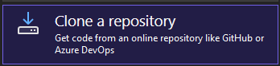
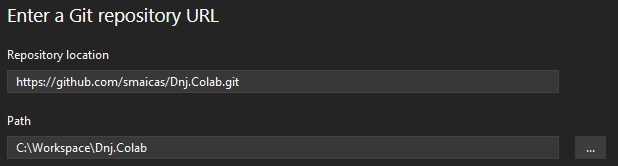

Introducci�n
============

Este repositorio pretende ser un punto de encuentro para programadores de todos los niveles. La idea es no solo aprender a programar si no aprender integraci�n de c�digo, conocer y adoptar una manera de trabajar profesional. Adecuada a la manera que se trabaja en una empresa. Es un repositorio de codigo abierto y cualquier persona est� invitada a colaborar.

* * *

Contenido
=========

* * *

�Como colaborar?
================

### Descargar repositorio

*   Manual:
    
    `git clone https://github.com/smaicas/Dnj.Colab.git`
    
*   Usando Visual Studio (recomendado):
    
    
    
    
    

### Creando un proyecto

*   Create the project in the solutions folder according to the type of project you are deploying.
*   Copy and fill the `README-Sample.md` located in Documentation folder. Rename it to `README.md` and put it in the root of your project

*   Crea el proyecto en la carpeta de soluciones de acuerdo al tipo de proyecto que implementes.
*   Copie y complete el `README-Sample.md` ubicado en la carpeta Documentaci�n. C�mbiele el nombre a `README.md` y ponlo en la ra�z de su proyecto.

* * *

Documentaci�n externa
=====================

[C# Referencia del lenguaje](https://learn.microsoft.com/en-us/dotnet/csharp/language-reference/)

[.NET Documentaci�n](https://learn.microsoft.com/en-us/dotnet/)

[Blazor Documentaci�n](https://learn.microsoft.com/es-es/aspnet/core/blazor/?view=aspnetcore-7.0)

[MAUI Documentaci�n](https://learn.microsoft.com/en-us/dotnet/maui/?view=net-maui-7.0)

* * *